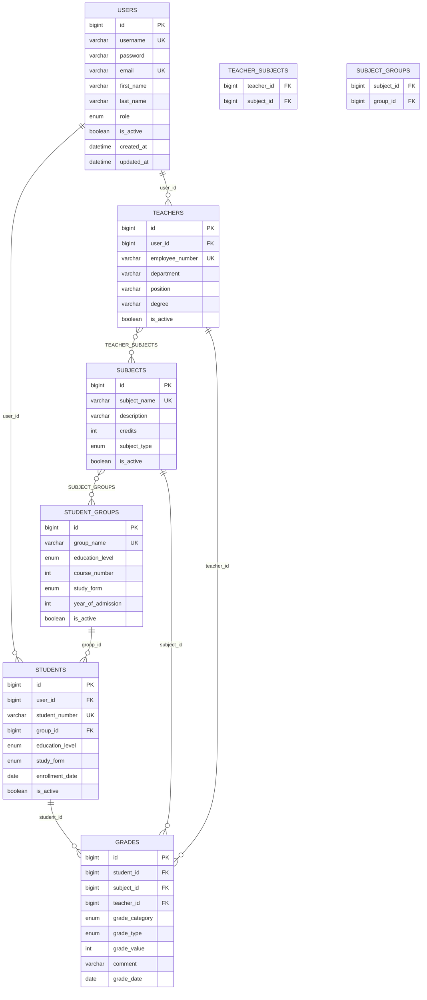
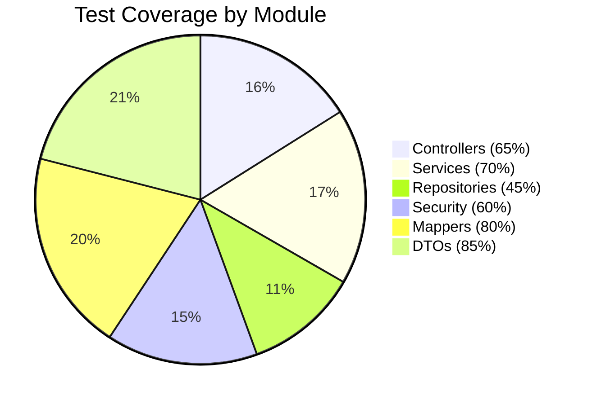

<div align="center">

# 🎓 Electronic Department System 

### *Комплексная система управления электронным деканатом университета*

[](https://www.oracle.com/java/)
[](https://spring.io/projects/spring-boot)
[](https://www.mysql.com/)
[](https://developer.mozilla.org/en-US/docs/Web/JavaScript)

[](https://maven.apache.org/)
[](https://jwt.io/)
[](https://sonarqube.org/)
[](LICENSE)


</div>

---

## 📖 О проекте

Electronic Department System — это **современная веб-система управления электронным деканатом университета**, созданная для полной автоматизации учебного процесса. Система обеспечивает эффективное управление студентами, преподавателями, учебными дисциплинами и академическими оценками с использованием современного технологического стека.

<div align="center">
  
### 🔥 Особенности проекта

| 🎯 **Особенность** | 📊 **Показатель** |
|:-----------------:|:-----------------:|
| **Test Coverage** | **62.4%** (SonarQube) |
| **Unit Tests** | **329 автотестов** |
| **API Endpoints** | **123 endpoints** |
| **Роли пользователей** | **5 уровней доступа** |
| **Архитектура** | **Unit of Work Pattern** |

</div>

---

## 🏗️ Автор проекта

<div align="center">

**Herman Lukyanov**  
*Full-Stack Developer & System Architect*

📧 *Для связи и предложений по развитию системы*

</div>

---

## 🚀 Технологический стек

<div align="center">

### Backend Technologies


### Frontend Technologies  


### Database & Storage


### Development Tools


### Testing & Quality


</div>

### 📋 Детальная спецификация технологий

| 🔧 **Категория** | 🛠️ **Технология** | 📝 **Версия** | 💼 **Назначение** |
|:-----------------|:-------------------|:-------------|:------------------|
| **Core Framework** | Spring Boot | 3.2.1 | Основной фреймворк приложения |
| **Language** | Java | 17 (LTS) | Основной язык программирования |
| **Security** | Spring Security + JWT | 6.2.1 | Аутентификация и авторизация |
| **Database** | MySQL | 8.0+ | Основная база данных |
| **ORM** | Hibernate/JPA | 6.4.1 | Объектно-реляционное отображение |
| **Build Tool** | Apache Maven | 3.6+ | Сборка и управление зависимостями |
| **Mapping** | MapStruct | 1.5.5 | Автоматическое маппирование DTO |
| **Documentation** | SpringDoc OpenAPI | 2.2.0 | Автогенерация API документации |
| **Migration** | Flyway | 10.17.0 | Управление миграциями БД |
| **Testing** | JUnit 5 + Mockito | 5.10+ | Юнит и интеграционное тестирование |
| **Code Coverage** | JaCoCo | 0.8.10 | Анализ покрытия тестами (62.4%) |
| **Code Quality** | SonarQube | 10.7+ | Статический анализ качества кода |
| **Frontend** | HTML5/CSS3/JS | ES6+ | Пользовательский интерфейс |

---

## 📋 Функциональность системы

<div align="center">

### 🎯 Ключевые возможности


  


</div>

### 🔧 Основные модули системы

| 🎯 **Модуль** | 📝 **Функциональность** | 🎭 **Роли доступа** | 📈 **Статус** |
|:-------------|:------------------------|:-------------------|:--------------|
| **👥 User Management** | Полное администрирование учетных записей | `ADMIN` | ✅ Готово |
| **🎓 Student Management** | Регистрация, управление данными студентов | `ADMIN`, `MANAGER` | ✅ Готово |
| **👩‍🏫 Teacher Management** | Профили и информация о преподавателях | `ADMIN`, `MANAGER` | ✅ Готово |
| **📚 Subject Management** | Каталог учебных дисциплин | `ADMIN`, `MANAGER` | ✅ Готово |
| **📊 Grade System** | Выставление и управление оценками | `TEACHER` | ✅ Готово |
| **👥 Group Management** | Организация студентов по группам | `MANAGER+` | ✅ Готово |
| **📁 Archive System** | Архивирование данных | `TEACHER+` | ✅ Готово |
| **📡 REST API** | Полный набор API endpoints | Все роли | ✅ Готово |

### 🎭 Система ролей и доступа

<div align="center">

| 👤 **Роль** | 🔑 **Уровень** | 📊 **Возможности** | 🎯 **Основные функции** |
|:-----------|:--------------|:------------------|:------------------------|
| **👑 ADMIN** | 5 | Полный контроль | Управление всей системой, пользователями |
| **🏢 MANAGER** | 4 | Управленческий | Учебный процесс, студенты, предметы |
| **🎓 TEACHER** | 3 | Преподавательский | Оценки, свои предметы и студенты |
| **📚 STUDENT** | 2 | Студенческий | Просмотр данных, оценок, расписания |
| **👀 GUEST** | 1 | Ограниченный | Публичная информация кафедры |

</div>

---

# 🏗️ Архитектура системы

<div align="center">

### 📐 Архитектурная схема

```
┌──────────────────────────────────────────────────────────────────┐
│                   🌐 PRESENTATION LAYER                          │
├──────────────────────────────────────────────────────────────────┤
│ 🎮 REST Controllers (9)  │ 📄 DTOs & Validation  │ 🌍 Web UI     │
│ • AuthController         │ • Request/Response    │ • HTML/CSS/JS │
│ • UserController         │ • Validation Rules    │ • Bootstrap   │
│ • StudentController      │ • Error Handling      │ • Static Files│
│ • TeacherController      │                       │               │
│ • SubjectController      │                       │               │
│ • GradeController        │                       │               │
│ • GroupController        │                       │               │
│ • ArchiveController      │                       │               │
│ • PublicController       │                       │               │
└──────────────────────────────────────────────────────────────────┘
                                    │
                                    ▼
┌──────────────────────────────────────────────────────────────────┐
│                  🧠 BUSINESS LOGIC LAYER                         │
├──────────────────────────────────────────────────────────────────┤
│ 🔧 Services (8+)         │ 🔄 MapStruct Mappers  │ 📋 DTOs       │
│ • UserService            │ • Entity ↔ DTO        │ • Business    │
│ • StudentService         │ • Auto-mapping        │ • Transfer    │
│ • TeacherService         │ • Type Safety         │ • Validation  │
│ • SubjectService         │                       │               │
│ • GradeService           │                       │               │
│ • GroupService           │                       │               │
│ • ArchiveService         │                       │               │
└──────────────────────────────────────────────────────────────────┘
                                    │
                                    ▼
┌──────────────────────────────────────────────────────────────────┐
│                   🗄️ DATA ACCESS LAYER                           │
├──────────────────────────────────────────────────────────────────┤
│ 📊 JPA Entities (15)     │ 🔍 Repositories      │ � Patterns     │
│ • User, Student, Teacher │ • Spring Data JPA    │ • Unit of Work │
│ • Subject, Grade, Group  │ • Custom Queries     │ • Transaction  │
│ • Archive Entities       │ • Pagination         │ • Management   │
│ • Flyway History         │                      │                │
└──────────────────────────────────────────────────────────────────┘
                                    │
                                    ▼
┌──────────────────────────────────────────────────────────────────┐
│                       🗄️ MySQL DATABASE                          │
│     12 Tables • 32 Indexes • 10 Foreign Keys • 85+ Records       │
└──────────────────────────────────────────────────────────────────┘

┌──────────────────────────────────────────────────────────────────┐
│                 ⚙️ CONFIGURATION LAYER                           │
├──────────────────────────────────────────────────────────────────┤
│ 🔐 Security Config       │ 🗃️ Database Config    │ 📚 API Docs   │
│ • Spring Security        │ • MySQL Connection    │ • Swagger UI  │
│ • JWT Authentication     │ • H2 for Testing      │ • OpenAPI 3   │
│ • Role-based Access      │ • Connection Pool     │ • Auto-gen    │
│ • CORS Settings          │ • Flyway Migrations   │               │
└──────────────────────────────────────────────────────────────────┘
```

</div>

Проект построен на основе **многослойной Clean Architecture** с применением паттерна **Unit of Work**:

### 📁 Структура проекта

```
📁 Electronic Department System
├── 🌐 pl (Presentation Layer)                    # Уровень представления
│   ├── 🎮 controllers/         # REST API контроллеры (9 контроллеров)
│   │   ├── AuthController      # Аутентификация
│   │   ├── UserController      # Управление пользователями
│   │   ├── StudentController   # Управление студентами
│   │   ├── TeacherController   # Управление преподавателями
│   │   ├── SubjectController   # Управление предметами
│   │   ├── GradeController     # Управление оценками
│   │   ├── GroupController     # Управление группами
│   │   ├── ArchiveController   # Архивные данные
│   │   └── PublicController    # Публичные данные
│   └── 📄 dto/                 # Объекты передачи данных
│
├── 🧠 bll (Business Logic Layer)                # Бизнес-логика
│   ├── 🔧 services/            # Бизнес-сервисы (8+ сервисов)
│   ├── 🔄 mappers/            # MapStruct мапперы
│   └── 📋 dto/                # Бизнес DTO объекты
│
├── 🗄️ dal (Data Access Layer)                   # Доступ к данным
│   ├── 📊 entities/           # JPA сущности (8 основных)
│   ├── 🔍 repositories/       # Spring Data репозитории
│   └── 🔧 UnitOfWork         # Паттерн единицы работы
│
├── ⚙️ config/                                   # Конфигурация
│   ├── 🔐 SecurityConfig      # Spring Security + JWT
│   ├── 🗃️ DatabaseConfig     # Настройки MySQL/H2
│   ├── 📚 SwaggerConfig       # OpenAPI документация
│   └── 🌍 CorsConfig         # CORS настройки
│
└── 🌍 static/                                   # Frontend ресурсы
    ├── 📄 *.html              # HTML страницы
    ├── 🎨 *.css               # CSS стили
    └── ⚡ *.js                # JavaScript логика
```

### 🔧 Основные паттерны проектирования

- **🏗️ Unit of Work** — Централизованное управление транзакциями
- **🗂️ Repository Pattern** — Абстракция доступа к данным  
- **🔄 DTO Pattern** — Безопасная передача данных между слоями
- **🎯 Dependency Injection** — Слабая связанность компонентов
- **🛡️ Strategy Pattern** — Гибкая система ролей и доступа

---

## 🛠️ Установка и запуск

<div align="center">

### ⚡ Системные требования


</div>

### 🚀 Быстрый старт

#### 1️⃣ Клонирование репозитория
```bash
git clone https://github.com/Gerasha0/electronic-department-system.git
cd electronic-department-system
```

#### 2️⃣ Настройка базы данных MySQL
```bash
# Установка и запуск MySQL
sudo apt install mysql-server
sudo service mysql start

# Создание пользователя и базы данных
sudo mysql -e "CREATE USER 'dept_user'@'localhost' IDENTIFIED WITH 'caching_sha2_password' BY 'b8ef2g6';"
sudo mysql -e "CREATE DATABASE electronic_department CHARACTER SET utf8mb4 COLLATE utf8mb4_unicode_ci;"
sudo mysql -e "GRANT ALL PRIVILEGES ON electronic_department.* TO 'dept_user'@'localhost'; FLUSH PRIVILEGES;"

# Загрузка тестовых данных (опционально)
sudo mysql -u dept_user -pb8ef2g6 electronic_department < electronic_department_dump_v0.8.3.sql
```

#### 3️⃣ Сборка и запуск приложения
```bash
# Сборка проекта
mvn clean compile

# Запуск в режиме разработки
mvn spring-boot:run

# ИЛИ запуск в production режиме (в фоне)
mvn spring-boot:run -Dspring-boot.run.profiles=prod > server.log 2>&1 &

# Остановка фонового процесса
pkill -f "spring-boot:run"
```

#### 4️⃣ Доступ к приложению
- **🌐 Главное приложение:** http://localhost:8080
- **📚 Swagger API:** http://localhost:8080/swagger-ui.html
- **📊 API Docs:** http://localhost:8080/api-docs

<div align="center">

### 🎯 Готовые пользователи для тестирования

| 👤 **Логин** | 🔑 **Пароль** | 🎭 **Роль** | 📝 **Возможности** |
|:------------|:-------------|:-----------|:-------------------|
| `admin` | `admin123` | **👑 ADMIN** | Полный доступ к системе |
| `manager` | `manager123` | **🏢 MANAGER** | Управление учебным процессом |
| `teacher1` | `teacher123` | **🎓 TEACHER** | Работа с оценками и предметами |
| `student1` | `student123` | **📚 STUDENT** | Просмотр данных и оценок |
| `guest` |  | **👀 GUEST** | Ограниченный доступ |

</div>

---

## 🔧 Git и система контроля версий

<div align="center">

### 🌿 Version Control


</div>

### 📥 Клонирование и настройка репозитория

```bash
# Клонирование репозитория с GitHub
git clone https://github.com/Gerasha0/electronic-department-system.git
cd electronic-department-system

# Или если скачали ZIP файл
cd /path/to/downloaded/project
git init
git remote add origin https://github.com/Gerasha0/electronic-department-system.git
git pull origin main --allow-unrelated-histories

# Проверка статуса
git status && git log --oneline -10
```

### 🔄 Основные Git операции

<details>
<summary><strong>📝 Работа с изменениями</strong></summary>

```bash
# Просмотр изменений
git status
git diff
git diff --staged

# Добавление файлов
git add .                               # Все файлы
git add src/main/java/com/kursova/     # Конкретная директория
git add *.java                         # По маске

# Коммит изменений
git commit -m "feat: добавить новый функционал"
git commit -m "fix: исправить критическую ошибку"
git commit -m "docs: обновить README"

# Исправление последнего коммита
git commit --amend -m "Исправленное сообщение"
```
</details>

<details>
<summary><strong>🌿 Работа с ветками</strong></summary>

```bash
# Создание и переключение веток
git checkout -b feature/new-feature
git checkout -b hotfix/critical-bug-fix
git checkout main

# Просмотр веток
git branch -a                    # Все ветки
git branch -r                    # Удаленные ветки

# Слияние веток
git checkout main
git merge feature/new-feature
git branch -d feature/new-feature

# Удаление удаленной ветки
git push origin --delete feature/old-feature
```
</details>

<details>
<summary><strong>🔄 Синхронизация с GitHub</strong></summary>

```bash
# Загрузка изменений
git fetch origin
git pull origin main

# Отправка изменений
git push origin main
git push origin feature/new-feature

# Принудительный push (осторожно!)
git push origin main --force
```
</details>

<details>
<summary><strong>🏷️ Работа с тегами</strong></summary>

```bash
# Создание тегов для релизов
git tag -a v0.8.3 -m "Релиз версии 0.8.3"
git tag -a v0.9.0 -m "Крупное обновление v0.9.0"

# Отправка тегов
git push origin --tags

# Просмотр тегов
git tag --list
git show v0.8.3
```
</details>

### ⚙️ Полезные Git алиасы

Добавьте в `~/.gitconfig`:
```ini
[alias]
    st = status
    co = checkout
    ci = commit -m
    br = branch
    lg = log --oneline --graph --all --decorate
    unstage = reset HEAD --
    last = log -1 HEAD
    undo = reset --soft HEAD~1
    amend = commit --amend --no-edit
    pushf = push --force-with-lease
    sync = "!git fetch origin && git rebase origin/main"
```

Использование:
```bash
git st          # git status
git lg          # красивый граф коммитов
git sync        # синхронизация с main
git amend       # исправление последнего коммита
```

### 📊 Git статистика проекта

```bash
# Статистика коммитов по авторам
git shortlog -sn

# История коммитов с графиком
git log --graph --pretty=format:'%Cred%h%Creset -%C(yellow)%d%Creset %s %Cgreen(%cr) %C(bold blue)<%an>%Creset' --abbrev-commit

# Размер репозитория
git count-objects -vH

# Файлы с наибольшим количеством изменений
git log --pretty=format: --name-only | sort | uniq -c | sort -rg | head -20
```

---

## 🔐 Безопасность

### 👤 Предустановленные пользователи:

| 👤 **Пользователь** | 🔑 **Пароль** | 🎭 **Роль** | 📝 **Описание**                     |
|---------------------|---------------|-------------|-------------------------------------|
| `admin`             | `admin123`    | **ADMIN**   | 👑 Полный доступ к системе          |
| `manager`           | `manager123`  | **MANAGER** | 🏢 Управление учебным процессом     |
| `teacher1`          | `teacher123`  | **TEACHER** | 🎓 Работа с оценками и предметами   |
| `teacher2`          | `teacher123`  | **TEACHER** | 🎓 Работа с оценками и предметами   |
| `student1`          | `student123`  | **STUDENT** | 📚 Просмотр своих данных и оценок   |
| `student2`          | `student123`  | **STUDENT** | 📚 Просмотр своих данных и оценок   |
| `student3`          | `student123`  | **STUDENT** | 📚 Просмотр своих данных и оценок   |
| `guest`             |     | **GUEST**   | 👀 Ограниченный доступ к информации |

### 🔧 Генерированный пароль Spring Security:
При каждом запуске система генерирует временный пароль для разработки (отображается в логах консоли).

## 📡 API Endpoints

<div align="center">

### 🌐 REST API Overview


**📚 API Documentation:** http://localhost:8080/swagger-ui.html

</div>

### 🌐 Публичные endpoints (без авторизации): **13 endpoints**

#### 👥 Информация о преподавателях:
- `GET /api/public/teachers` - список активных преподавателей
- `GET /api/public/teachers/{id}` - информация о преподавателе по ID
- `GET /api/public/teachers/search?name={name}` - поиск преподавателей по имени

#### 📚 Информация о предметах:
- `GET /api/public/subjects` - список активных предметов
- `GET /api/public/subjects/{id}` - информация о предмете по ID
- `GET /api/public/subjects/search?name={name}` - поиск предметов по названию

#### 🎓 Информация о студентах:
- `GET /api/public/students` - список активных студентов
- `GET /api/public/students/search?name={name}` - поиск студентов по имени

#### 🏛️ Системная информация:
- `GET /api/public/education-levels` - список уровней образования
- `GET /api/public/health` - проверка работоспособности системы
- `GET /api/public/status` - статус системы и версия
- `GET /api/public/department-info` - общая информация о кафедре

#### 🌍 Главная страница:
- `GET /` - главная страница системы

---

### 🔐 Аутентификация: **5 endpoints**
- `POST /api/auth/login` - авторизация пользователя (username/password)
- `POST /api/auth/register` - регистрация нового пользователя
- `POST /api/auth/logout` - выход из системы
- `POST /api/auth/guest-login` - авторизация гостя
- `GET /api/auth/current-user` - информация о текущем пользователе

---

### 🔒 Защищенные endpoints по ролям:

<div align="center">

| 🎭 **Роль** | 📊 **Endpoints** | 🔑 **Доступ** | 📝 **Основные возможности** |
|:-----------|:----------------|:-------------|:---------------------------|
| **👑 ADMIN** | 18 endpoints | Полный | Управление пользователями, все операции |
| **🏢 MANAGER** | 35 endpoints | Управленческий | Студенты, группы, предметы |
| **🎓 TEACHER** | 45 endpoints | Преподавательский | Оценки, свои предметы |
| **📚 STUDENT** | 15 endpoints | Студенческий | Просмотр своих данных |
| **👀 GUEST** | 13 endpoints | Только публичные | Общая информация |

</div>

#### 👑 **ADMIN** - Управление пользователями (18 endpoints):
```
POST   /api/users                     # Создание пользователя
POST   /api/users/with-password       # Создание с паролем
GET    /api/users/{id}                # Информация о пользователе
GET    /api/users                     # Список всех пользователей
GET    /api/users/by-username/{name}  # Поиск по имени пользователя
GET    /api/users/by-role/{role}      # Пользователи по роли
GET    /api/users/active/by-role/{role} # Активные по роли
GET    /api/users/active              # Все активные пользователи
GET    /api/users/search              # Поиск пользователей
PUT    /api/users/{id}                # Обновление пользователя
PUT    /api/users/{id}/password       # Смена пароля
PUT    /api/users/{id}/activate       # Активация пользователя
PUT    /api/users/{id}/deactivate     # Деактивация пользователя
DELETE /api/users/{id}                # Удаление пользователя
GET    /api/users/{id}/exists         # Проверка существования
GET    /api/users/username/{name}/exists # Проверка имени
GET    /api/users/email/{email}/exists   # Проверка email
```

#### 🏢 **MANAGER+** - Управление студентами (17 endpoints):
```
POST   /api/students                  # Создание студента
GET    /api/students/{id}             # Информация о студенте
GET    /api/students                  # Список всех студентов
GET    /api/students/active           # Активные студенты
GET    /api/students/without-group    # Студенты без группы
GET    /api/students/group/{groupId}  # Студенты по группе
GET    /api/students/search           # Поиск студентов
GET    /api/students/search-without-group # Поиск без группы
PUT    /api/students/{id}             # Обновление студента
PUT    /api/students/{id}/activate    # Активация студента
PUT    /api/students/{id}/deactivate  # Деактивация студента
DELETE /api/students/{id}             # Удаление студента
GET    /api/students/search-for-group # Поиск для группы
GET    /api/students/current          # Текущий студент
```

#### 🏢 **MANAGER+** - Управление группами (16 endpoints):
```
POST   /api/groups                    # Создание группы
GET    /api/groups/{id}               # Информация о группе
GET    /api/groups                    # Список всех групп
GET    /api/groups/active             # Активные группы
GET    /api/groups/search             # Поиск групп
GET    /api/groups/teacher/{teacherId} # Группы преподавателя
GET    /api/groups/{id}/students      # Студенты группы
POST   /api/groups/{groupId}/students/{studentId} # Добавить студента
DELETE /api/groups/{groupId}/students/{studentId} # Удалить студента
PUT    /api/groups/{id}/students      # Обновить состав группы
PUT    /api/groups/{id}               # Обновление группы
PUT    /api/groups/{id}/activate      # Активация группы
PUT    /api/groups/{id}/deactivate    # Деактивация группы
DELETE /api/groups/{id}               # Удаление группы
```

#### 🏢 **MANAGER+** - Управление предметами (15 endpoints):
```
GET    /api/subjects                  # Список предметов
GET    /api/subjects/{id}             # Информация о предмете
POST   /api/subjects                  # Создание предмета
PUT    /api/subjects/{id}             # Обновление предмета
DELETE /api/subjects/{id}             # Удаление предмета
POST   /api/subjects/{subjectId}/teachers/{teacherId} # Назначить преподавателя
DELETE /api/subjects/{subjectId}/teachers/{teacherId} # Отменить назначение
GET    /api/subjects/teacher/{teacherId} # Предметы преподавателя
GET    /api/subjects/group/{groupId}  # Предметы группы
GET    /api/subjects/public           # Публичные предметы
GET    /api/subjects/{subjectId}/groups # Группы предмета
GET    /api/subjects/{subjectId}/available-groups # Доступные группы
POST   /api/subjects/{subjectId}/groups/{groupId} # Назначить группу
DELETE /api/subjects/{subjectId}/groups/{groupId} # Отменить назначение группы
GET    /api/subjects/{subjectId}/teachers # Преподаватели предмета
GET    /api/subjects/{subjectId}/available-teachers # Доступные преподаватели
```

#### 🎓 **TEACHER+** - Управление оценками (18 endpoints):
```
POST   /api/grades                    # Создание оценки
POST   /api/grades/by-ids             # Создание по ID
POST   /api/grades/by-user-ids        # Создание по пользователям
GET    /api/grades/{id}               # Информация об оценке
GET    /api/grades                    # Список оценок
GET    /api/grades/student/{studentId} # Оценки студента
GET    /api/grades/my-grades          # Мои оценки (для студента)
GET    /api/grades/teacher/{teacherId} # Оценки преподавателя
GET    /api/grades/subject/{subjectId} # Оценки по предмету
GET    /api/grades/student/{studentId}/subject/{subjectId} # Оценки студента по предмету
GET    /api/grades/student/{studentId}/final # Итоговые оценки
GET    /api/grades/type/{gradeType}   # Оценки по типу
PUT    /api/grades/{id}               # Обновление оценки
DELETE /api/grades/{id}               # Удаление оценки
GET    /api/grades/student/{studentId}/average # Средний балл студента
GET    /api/grades/student/{studentId}/subject/{subjectId}/average # Средний балл по предмету
GET    /api/grades/diagnostics        # Диагностика оценок
```

#### 🎓 **TEACHER+** - Управление преподавателями (14 endpoints):
```
POST   /api/teachers                  # Создание преподавателя
GET    /api/teachers/{id}             # Информация о преподавателе
GET    /api/teachers                  # Список преподавателей
GET    /api/teachers/public           # Публичный список
GET    /api/teachers/active           # Активные преподаватели
GET    /api/teachers/subject/{subjectId} # Преподаватели предмета
GET    /api/teachers/search           # Поиск преподавателей
GET    /api/teachers/{id}/students    # Студенты преподавателя
GET    /api/teachers/{id}/subjects    # Предметы преподавателя
GET    /api/teachers/{id}/grades      # Оценки преподавателя
PUT    /api/teachers/{id}             # Обновление преподавателя
PUT    /api/teachers/{id}/activate    # Активация преподавателя
PUT    /api/teachers/{id}/deactivate  # Деактивация преподавателя
DELETE /api/teachers/{id}             # Удаление преподавателя
```

#### 🎓 **TEACHER+** - Архивные данные (17 endpoints):
```
GET    /api/archive/groups            # Архивные группы
GET    /api/archive/students          # Архивные студенты
GET    /api/archive/grades            # Архивные оценки
GET    /api/archive/groups/search     # Поиск архивных групп
GET    /api/archive/students/search   # Поиск архивных студентов
GET    /api/archive/students/by-group/{originalGroupId} # Студенты архивной группы
GET    /api/archive/grades/by-student/{originalStudentId} # Оценки архивного студента
GET    /api/archive/groups/by-date-range # Группы по датам
GET    /api/archive/statistics        # Статистика архива
POST   /api/archive/students/{studentId} # Архивировать студента
POST   /api/archive/groups/{groupId}  # Архивировать группу
DELETE /api/archive/groups/{id}       # Удалить из архива групп
DELETE /api/archive/students/{id}     # Удалить из архива студентов
DELETE /api/archive/grades/{id}       # Удалить из архива оценок
```

---

### 📊 Статистика API

<div align="center">

| 📋 **Категория** | 📊 **Количество** | 📝 **Примечания** |
|:----------------|:-----------------|:------------------|
| **Всего endpoints** | **123** | Полный REST API |
| **Публичные** | **13** | Без авторизации |
| **Аутентификация** | **5** | JWT токены |
| **ADMIN только** | **18** | Управление пользователями |
| **MANAGER+** | **48** | Студенты, группы, предметы |
| **TEACHER+** | **49** | Оценки, архив, преподаватели |
| **STUDENT+** | **15** | Просмотр данных |
| **GET методы** | **87** | Чтение данных |
| **POST методы** | **18** | Создание |
| **PUT методы** | **15** | Обновление |
| **DELETE методы** | **11** | Удаление |

</div>

### 🔧 API Testing

Все endpoints доступны для тестирования через:
- 📚 **Swagger UI**: http://localhost:8080/swagger-ui.html
- 📄 **OpenAPI Spec**: http://localhost:8080/api-docs
- 🧪 **Manual Tests**: `manual_tests.http` (в корне проекта)

## 📊 База данных

<div align="center">

### �️ Database Architecture


</div>

### �🐬 MySQL Setup (Linux/Ubuntu)

#### 📦 Установка и первоначальная настройка
```bash
# Установка MySQL сервера
sudo apt update && sudo apt install mysql-server

# Запуск службы MySQL
sudo systemctl start mysql
sudo systemctl enable mysql  # автозапуск

# Вход в MySQL от root
sudo mysql
```

#### 👤 Создание пользователя и базы данных
```sql
-- Создание пользователя для приложения
CREATE USER 'dept_user'@'localhost' IDENTIFIED WITH 'caching_sha2_password' BY 'b8ef2g6';

-- Создание базы данных
CREATE DATABASE electronic_department CHARACTER SET utf8mb4 COLLATE utf8mb4_unicode_ci;

-- Выдача всех прав пользователю
GRANT ALL PRIVILEGES ON electronic_department.* TO 'dept_user'@'localhost';
FLUSH PRIVILEGES;

-- Проверка созданных объектов
SHOW DATABASES;
SELECT User, Host FROM mysql.user WHERE User = 'dept_user';
```

#### 📋 Работа с дампом базы данных
```bash
# Проверка дампа на наличие команды создания БД
grep -i -m1 -E "CREATE DATABASE|USE " electronic_department_dump_v0.8.3.sql

# Загрузка данных из дампа
sudo mysql -u dept_user -pb8ef2g6 electronic_department < electronic_department_dump_v0.8.3.sql

# Создание дампа текущей БД
sudo mysqldump -u dept_user -pb8ef2g6 electronic_department > electronic_department_dump_$(date +%Y%m%d_%H%M%S).sql

# Быстрая проверка загруженных данных
sudo mysql -u dept_user -pb8ef2g6 -e "USE electronic_department; SHOW TABLES; SELECT COUNT(*) as users FROM users;"
```

### 🗂️ Структура базы данных

<div align="center">

#### 📈 Database Statistics
| 📊 **Показатель** | 🔢 **Значение** |
|:-----------------|:---------------|
| **Таблицы** | 12 таблиц (8 основных + 4 служебных) |
| **Индексы** | 32 индекса для оптимизации |
| **Связи** | 10 внешних ключей |
| **Тестовые данные** | 85+ записей |

</div>

#### 🏗️ Схема основных таблиц



#### 📋 Описание основных таблиц

| 🗃️ **Таблица** | 📝 **Назначение** | 🔑 **Ключевые поля** |
|:---------------|:------------------|:--------------------|
| `users` | Пользователи системы | username, email, role, is_active |
| `students` | Информация о студентах | student_number, group_id, education_level |  
| `teachers` | Информация о преподавателях | employee_number, department, position |
| `student_groups` | Группы студентов | group_name, course_number, study_form |
| `subjects` | Учебные предметы | subject_name, credits, subject_type |
| `grades` | Оценки студентов | grade_category, grade_type, grade_value |
| `teacher_subjects` | Связи преподаватель-предмет | teacher_id, subject_id |
| `subject_group` | Связи предмет-группа | subject_id, group_id |
| `archived_grades` | Архивированные оценки | original_grade_id, archive_reason |
| `archived_students` | Архивированные студенты | original_student_id, archive_date |
| `archived_student_groups` | Архивированные группы | original_group_id, archive_reason |
| `flyway_schema_history` | История миграций БД | version, description, success |

### 🔄 Миграции и версионирование

```bash
# Flyway миграции (по умолчанию отключены)
# Для включения в application.properties:
spring.flyway.enabled=true

# Ручное выполнение миграций
mvn flyway:migrate

# Информация о статусе миграций
mvn flyway:info

# Очистка БД (только для разработки!)
mvn flyway:clean
```

---

## 🧪 Тестирование и качество кода

<div align="center">

### 📊 Test Coverage & Quality Metrics


</div>

### ✅ Статистика тестирования

| 📋 **Метрика** | 📊 **Значение** | 📝 **Описание** |
|:--------------|:---------------|:----------------|
| **Test Coverage** | **62.4%** | JaCoCo покрытие (SonarQube) |
| **Total Tests** | **329 тестов** | Общее количество автотестов |
| **Service Tests** | **34 теста** | Тестирование бизнес-логики |
| **Controller Tests** | **102+ теста** | REST API тестирование |
| **Security Tests** | **45+ тестов** | Тесты безопасности и авторизации |

### 🎯 Покрытие тестами по модулям



### 🚀 Быстрый запуск тестов

#### ⚡ Основные команды тестирования
```bash
# Запуск всех unit тестов с покрытием
mvn test

# Запуск тестов без JaCoCo (быстрее)
mvn test -Djacoco.skip=true

# Полная проверка с интеграционными тестами
mvn clean verify

# Генерация HTML отчета покрытия
mvn jacoco:report

# Просмотр отчета покрытия
xdg-open target/site/jacoco/index.html  # Linux
open target/site/jacoco/index.html      # macOS
```

#### 🧪 Что включает тестирование

<div align="center">

| ✅ **Тип тестов** | 📊 **Количество** | 🎯 **Покрытие** |
|:-----------------|:----------------|:---------------|
| **Controller Tests** | 102+ тестов | REST API endpoints |
| **Service Tests** | 130+ тестов | Бизнес-логика |
| **Configuration Tests** | 45+ тестов | Настройки и безопасность |
| **Entity Tests** | 52+ тестов | JPA сущности и репозитории |

</div>

- ✅ **H2 Database Testing** — изолированные тесты в памяти
- ✅ **MockMvc Testing** — тестирование REST API
- ✅ **Mockito Integration** — мокирование зависимостей  
- ✅ **Spring Security Testing** — проверка ролей и доступа
- ✅ **JPA Testing** — тестирование репозиториев
- ✅ **Exception Handling** — обработка ошибок
- ✅ **DTO Validation** — валидация входных данных

### 📊 SonarQube интеграция

<div align="center">


</div>

#### 🐘 PostgreSQL для SonarQube
```bash
# Установка PostgreSQL
sudo apt install postgresql postgresql-contrib

# Создание пользователя и БД для SonarQube
sudo -u postgres psql -c "CREATE USER sonarqube WITH PASSWORD 'sonarqube';"
sudo -u postgres psql -c "CREATE DATABASE sonarqube OWNER sonarqube;"
sudo -u postgres psql -c "GRANT ALL PRIVILEGES ON DATABASE sonarqube TO sonarqube;"
sudo -u postgres psql -d sonarqube -c "GRANT ALL ON SCHEMA public TO sonarqube;"
```

#### 🚀 Установка и настройка SonarQube
```bash
# Загрузка и установка SonarQube
sudo mkdir -p /opt/sonarqube && cd /opt/sonarqube
sudo wget https://binaries.sonarsource.com/Distribution/sonarqube/sonarqube-10.7.0.96327.zip
sudo unzip -q sonarqube-10.7.0.96327.zip

# Создание пользователя
sudo useradd -r -s /bin/false sonarqube
sudo chown -R sonarqube:sonarqube /opt/sonarqube/

# Настройка конфигурации
sudo nano /opt/sonarqube/sonarqube-10.7.0.96327/conf/sonar.properties
```

**Добавить в sonar.properties:**
```properties
sonar.jdbc.username=sonarqube
sonar.jdbc.password=sonarqube
sonar.jdbc.url=jdbc:postgresql://localhost:5432/sonarqube
sonar.web.host=0.0.0.0
sonar.web.port=9000
```

#### � Запуск анализа кода
```bash
# Запуск SonarQube сервера
sudo systemctl start sonarqube

# Анализ проекта с генерацией токена
mvn clean verify sonar:sonar \
  -Dsonar.projectKey=electronic-department-system \
  -Dsonar.projectName="Electronic Department System" \
  -Dsonar.host.url=http://localhost:9000 \
  -Dsonar.token=YOUR_GENERATED_TOKEN

# Веб-интерфейс SonarQube
xdg-open http://localhost:9000
```

### 🎨 PurgeCSS оптимизация

```bash
# Установка PurgeCSS
sudo npm install -g purgecss

# Оптимизация CSS файлов
purgecss --css ./src/main/resources/static/*.css \
         --content ./src/main/resources/static/*.html ./src/main/resources/static/*.js \
         --output ./src/main/resources/static/purgecss --rejected
```

---

## 🔄 Версионирование и история разработки

<div align="center">

### 📈 Project Evolution


</div>

### 🏷️ Текущая версия: **v0.8.3**

### 📋 История релизов

<details>
<summary><strong>🔥 v0.8.3 - Стабилизация и улучшения</strong> <em>(Latest)</em></summary>

#### 🐛 Исправления багов:
- ✅ Устранены ошибки отображения и прав для кнопок на страницах дисциплин и групп
- ✅ Добавлены недостающие значения форм обучения
- ✅ Исправлены фильтры по уровню образования и формам обучения
- ✅ Исправлены ошибки при добавлении, редактировании и удалении оценок

#### 🔧 Улучшения функциональности:
- ✅ Обновлена логика добавления студентов в группы
- ✅ Автоматическое присвоение и обновление параметров студентов при изменении группы
- ✅ Предупреждения при конфликте данных
- ✅ Корректная работа архива
- ✅ Удаление группы больше не удаляет студентов (отвязывает их)

#### 🧪 Тестирование:
- ✅ Исправлены 3 автотеста
- ✅ Повышена стабильность и согласованность данных
</details>

<details>
<summary><strong>📊 v0.8.0 - Унификация системы оценок</strong></summary>

#### ⚡ Ключевые изменения:
- ✅ Унифицирована система категорий и типов оценок
- ✅ Создан новый enum `GradeCategory` (Поточний контроль, Підсумковий контроль, Перездача, Відпрацювання)
- ✅ Обновлен enum `GradeType` с корректными типами работ
- ✅ Добавлена миграция БД `V10__update_grade_category_system.sql`
- ✅ Унифицированы фильтры и таблицы на всех страницах
- ✅ Добавлены тесты безопасности и исправлен `JwtAuthFilter`
- ✅ Flyway отключен по умолчанию
</details>

<details>
<summary><strong>🎓 v0.6.8 - Улучшения для студентов</strong></summary>

- ✅ Исправлено отображение страниц для студентов
- ✅ Оценки и дисциплины корректно загружаются из групп
- ✅ Переработана система архивации под новые типы оценок
- ✅ Улучшено отображение количества групп в дисциплинах
</details>

<details>
<summary><strong>📈 v0.6.7 - Расширение системы оценок</strong></summary>

- ✅ Расширен enum `GradeType`
- ✅ Исправлена фильтрация оценок для учителей
- ✅ Добавлены колонки "Рівень освіти" и "Форма навчання"
- ✅ Предоставлены полные права администратору
</details>

<details>
<summary><strong>🏢 v0.6.5 - Система управления для менеджеров</strong></summary>

- ✅ Полная система дисциплин и групп для менеджеров
- ✅ Редактирование, добавление, просмотр, фильтрация
- ✅ Модальные окна, добавление дисциплин и групп
- ✅ Добавление студентов в группы
</details>

<details>
<summary><strong>🎯 Ранние версии (v0.1 - v0.5)</strong></summary>

- **v0.5.7**: Улучшения UI, скрытие поиска для студентов
- **v0.5.6**: Ограничение доступа учителей по назначению
- **v0.5.5**: Добавлен пользователь гость, фильтры поиска
- **v0.5.1**: Role-Based Access Control (RBAC)
- **v0.5.0**: Полный редизайн системы
- **v0.3.0**: Полная система аутентификации
- **v0.2.0**: 37 unit тестов
- **v0.1-SNAPSHOT**: Первоначальная версия
</details>


## � Поддержка и сообщество

<div align="center">

### 🤝 Contribute & Support


**⭐ Если проект был полезен, поставьте звездочку на GitHub!**

</div>

### 👨‍💻 Контакты разработчика

<div align="center">

**Herman Lukyanov**  
*Full-Stack Developer & System Architect*

[](https://github.com/Gerasha0)
[](mailto:mensotor@pm.me)

📧 *Для вопросов, предложений и сотрудничества*

</div>

### 🐛 Сообщение об ошибках

При обнаружении багов, пожалуйста, создайте [Issue](https://github.com/Gerasha0/electronic-department-system/issues) с указанием:

#### � Шаблон отчета об ошибке:
```markdown
**Описание проблемы**
Краткое и ясное описание ошибки.

**Шаги для воспроизведения**
1. Перейти к '...'
2. Нажать на '...'  
3. Прокрутить до '...'
4. Увидеть ошибку

**Ожидаемое поведение**
Описание того, что должно было произойти.

**Скриншоты**
При необходимости добавьте скриншоты.

**Системная информация:**
- OS: [e.g. Ubuntu 22.04]
- Java: [e.g. 17]
- Browser: [e.g. chrome, safari]
- Version: [e.g. 0.8.3]

**Дополнительная информация**
Любая другая полезная информация.
```

### 💡 Предложения улучшений

Есть идеи для новых функций? Создайте [Feature Request](https://github.com/Gerasha0/electronic-department-system/issues) с тегом `enhancement`:

#### ✨ Шаблон предложения:
```markdown
**Что за функция?**
Краткое описание предлагаемой функции.

**Обоснование**
Объяснение зачем эта функция нужна.

**Предлагаемое решение**
Описание того, как это должно работать.

**Альтернативы**
Любые альтернативные решения, которые вы рассматривали.

**Дополнительная информация**
Добавьте любую другую информацию или скриншоты.
```
---

## � Лицензия и правовая информация

<div align="center">

### 📋 License Information


</div>

### 🎓 Образовательная лицензия

Этот проект разработан в **образовательных целях** в рамках университетской программы обучения.

#### 📖 Условия использования:
- ✅ **Изучение кода** — свободно изучайте архитектуру и реализацию
- ✅ **Образовательные цели** — используйте для обучения и научных исследований  
- ✅ **Некоммерческое использование** — разрешено для личных проектов
- ✅ **Вклад в развитие** — приветствуются улучшения и исправления

#### ⚠️ Ограничения:
- ❌ **Коммерческое использование** — запрещено без письменного согласия
- ❌ **Перепродажа** — запрещена продажа или монетизация кода
- ❌ **Претензии на авторство** — обязательна ссылка на оригинального автора

### 🏛️ Академическая честность

При использовании данного проекта в учебных целях:
- 📚 **Цитируйте источник** — указывайте ссылку на репозиторий
- 🎯 **Понимайте код** — изучайте принципы, а не копируйте слепо
- 🤝 **Соблюдайте этику** — не выдавайте чужую работу за свою

### 📄 Правовые аспекты

**Отказ от ответственности:**
- Код предоставляется "как есть" без каких-либо гарантий
- Автор не несет ответственности за любые убытки от использования
- Все внешние зависимости подчиняются своим лицензиям

**Интеллектуальная собственность:**
- Авторские права принадлежат Herman Lukyanov © 2025
- Все торговые марки принадлежат их владельцам
- Open source библиотеки используются согласно их лицензиям

### 🔗 Ссылки и ресурсы

#### 📚 Использованные технологии и их лицензии:
- **Spring Framework** — Apache License 2.0
- **MySQL** — GPL License 2.0 
- **JUnit** — Eclipse Public License 2.0
- **Maven** — Apache License 2.0

#### 🌐 Полезные ссылки:
- 📖 [Spring Boot Documentation](https://spring.io/projects/spring-boot)
- 🛡️ [Spring Security Guide](https://spring.io/projects/spring-security)  
- 🗄️ [MySQL Documentation](https://dev.mysql.com/doc/)
- 🧪 [JUnit 5 User Guide](https://junit.org/junit5/docs/current/user-guide/)

---

<div align="center">

**Создано с ❤️ для образовательного сообщества**

*© 2025 Herman Lukyanov. Educational Use License.*

**[⬆️ Наверх](#-electronic-department-system)**

</div>

